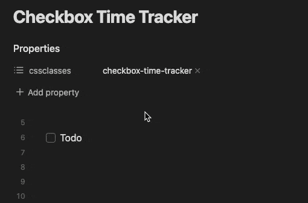
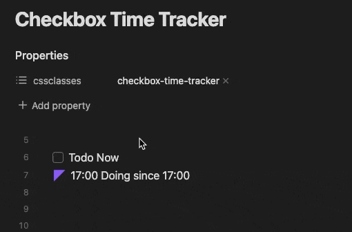

# Checkbox Time Tracker

## Overview

Insert timestamp when you check off the checkbox.
Examples are below.

Timestamp format is `HH:mm` and if you want to include the end time, use `HH:mm-HH:mm`

## Screenshots

Click the checkbox to insert the current time.

By enabling Doing Status, you can also insert start and end times.

## Installation

### Installing the plugin using BRAT

1. Install the BRAT plugin
    1. Open `Settings` -> `Community Plugins`
    2. Disable safe mode, if enabled
    3. *Browse*, and search for "BRAT" 
    4. Install the latest version of **Obsidian 42 - BRAT**
2. Open BRAT settings (`Settings` -> `Obsidian 42 - BRAT`)
    1. Scroll to the `Beta Plugin List` section
    2. `Add Beta Plugin`
    3. Specify this repository: `udus122/checkbox-time-tracker`
3. Enable the `Checkbox Time Tracker` plugin (`Settings` -> `Community Plugins`)

## Usage

1. Add the `checkbox-time-tracker`(default, can be changed by setting) class to the [`cssclasses` property](https://help.obsidian.md/Editing+and+formatting/Properties#Default+properties) of the page on which you want to enable time tracking
2. Then, when you check the checkbox on that page, the timestamp will be inserted.

## Doing status style

This plugin does not include styling for the Doing status (`- [/]`).
Please refer to the following CSS snippet to install it.

- https://publish.obsidian.md/tasks/Reference/Status+Collections/SlRvb's+Alternate+Checkboxes
- https://github.com/netgamesekai/obsidian-checkbox-css
- Or whatever you like
