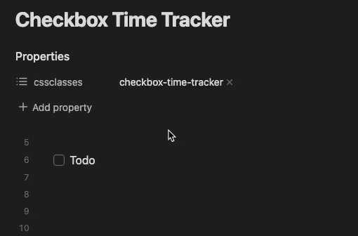

# Checkbox Time Tracker

## 概要

チェックボックスをチェックした時にタイムスタンプを挿入します。
以下に例を示します。

タイムスタンプの形式は `HH:mm` で、終了時間を含めたい場合は `HH:mm-HH:mm` を使用します。

## スクリーンショット

チェックボックスをクリックして現在の時間を挿入します。

「実行中ステータス」を有効にすることで、開始時間と終了時間も挿入できます。

## インストール

### BRATを使用してプラグインをインストールする方法

1. BRATプラグインをインストールする
    1. `設定` -> `コミュニティプラグイン`を開く
    2. 安全モードが有効な場合は無効にする
    3. *ブラウズ*して、「BRAT」を検索する
    4. **Obsidian 42 - BRAT** の最新バージョンをインストールする
2. BRAT設定を開く（`設定` -> `Obsidian 42 - BRAT`）
    1. `Beta Plugin List` セクションまでスクロールする
    2. `Add Beta Plugin` を選択
    3. このリポジトリを指定する: `udus122/checkbox-time-tracker`
3. `Checkbox Time Tracker` プラグインを有効にする（`設定` -> `コミュニティプラグイン`）

## 使い方

1. 時間追跡を有効にしたいページの [`cssclasses` プロパティ](https://help.obsidian.md/Editing+and+formatting/Properties#Default+properties) に `checkbox-time-tracker`クラス（デフォルト、設定で変更可能）を追加する
2. そのページのチェックボックスをチェックすると、タイムスタンプが挿入されます。

## Doingステータスのスタイル

このプラグインは「実行中ステータス」(`- [/]`)のスタイリングを含んでいません。
以下のCSSスニペットを参照してください。

-  https://publish.obsidian.md/tasks/Reference/Status+Collections/SlRvb's+Alternate+Checkboxes
-  https://github.com/netgamesekai/obsidian-checkbox-css
-  またはお好みで選択してください
